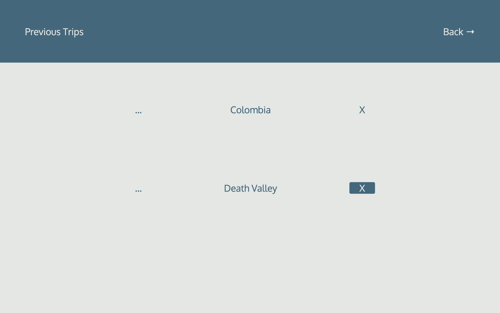

# Travel Track App

Travel Track is an app used to record previous trip's details and plan upcoming trips.

The Menu gives access to the list of previous and upcoming trips, as well as adding a new trip.

 

## Previous Trips
Each trip has a detail section where you can organize and update data within 3 categories: activities, food experiences and accomodations. Each category has a required description section, a cost, date, location and rating section.

 

## Upcoming Trips
Each trip has a detail section where you can organize and update the date scheduled for the trip, the budget and a memo section. You can add more details to the planner by providing a description (required), an average cost or price and a date if needed. Also, you can check or uncheck the status of it.

 

## Technologies Used

HTML5 | CSS3 | Javascript | Node.js | Express | MongoDB | Mongoose | OAuth2 

 

## Getting Started

http://travel-track.herokuapp.com/

 

## Next Steps 

- Add more categories for the upcoming trips 
- Update the starting budget automatically when a detail with an expense has been added and completed
- Upload photos of previous trips
- Add a map feature to both previous and upcoming trips to draw itineraries